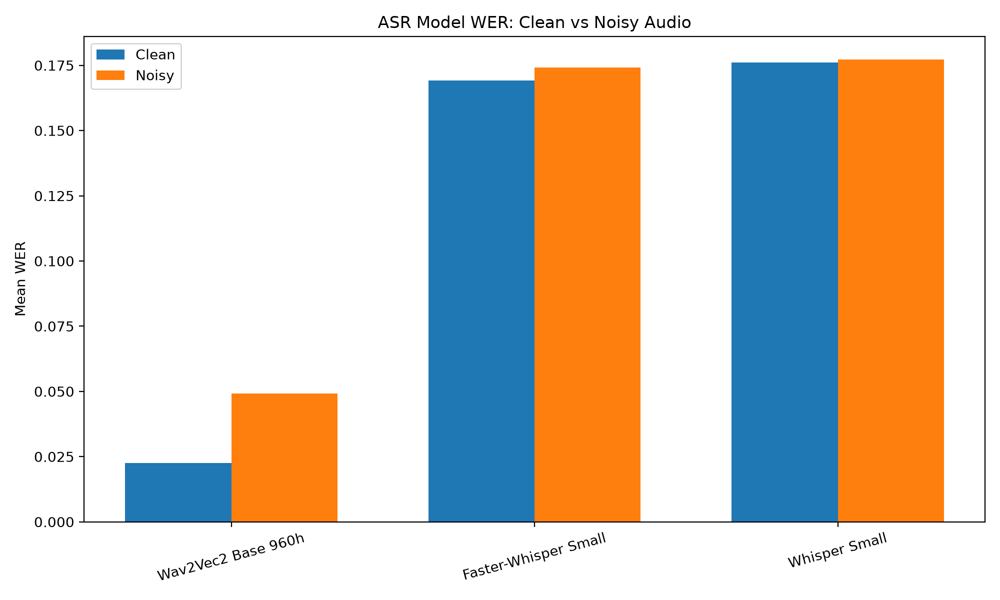
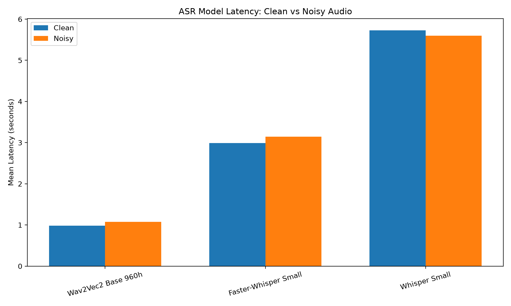
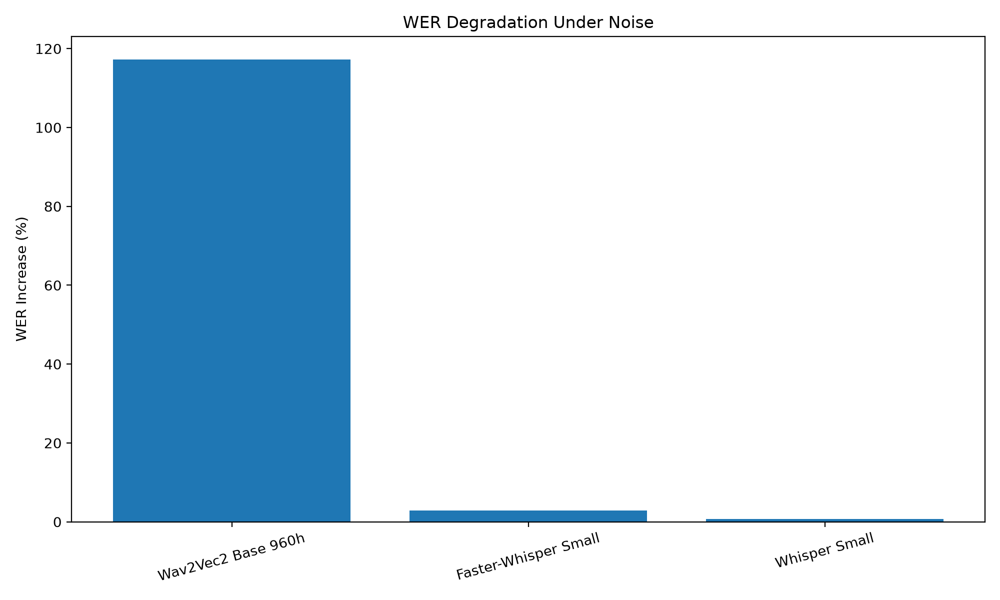

# ASR Model Benchmark

A reproducible benchmark comparing three automatic speech recognition (ASR) models under clean and controlled noisy speech conditions.

The project evaluates **Whisper Small**, **Faster-Whisper Small**, and **Wav2Vec2 Base 960h** using Word Error Rate (WER), inference latency, memory usage, and robustness to controlled noise.

---

## Models Evaluated

| Model | Implementation | CPU Configuration |
|---|---|---|
| Whisper Small | Hugging Face Transformers | PyTorch |
| Faster-Whisper Small | CTranslate2 | INT8 |
| Wav2Vec2 Base 960h | Hugging Face Transformers | PyTorch |

### Model References

- `openai/whisper-small`
- `Systran/faster-whisper-small`
- `facebook/wav2vec2-base-960h`

---

## Objective

The objective of this project is to compare selected ASR models under the same experimental conditions.

The benchmark evaluates:

- Word Error Rate (WER)
- Inference latency
- Real-Time Factor (RTF)
- Process memory usage
- Robustness to controlled noise
- CPU inference performance

The goal is not to identify a universally best ASR model, but to determine which model performs best for the tested experimental configuration.

---

# Dataset

The benchmark uses a 20-sample subset of the **LibriSpeech ASR clean test set**.

### Dataset Configuration

| Property | Value |
|---|---|
| Dataset | LibriSpeech ASR |
| Split | Clean / Test |
| Language | English |
| Clean samples | 20 |
| Noisy samples | 20 |
| Sampling rate | 16 kHz |
| Noise type | White Gaussian noise |
| Noise level | 10 dB SNR |
| Random seed | Fixed for reproducibility |

The selected audio files are stored locally under:

```text
data/clean_wav/
```

The corresponding noisy recordings are stored under:

```text
data/noisy_wav/
```

---

# Experimental Setup

The benchmark was executed using CPU inference.

### Environment

```text
Python      : 3.13.7
PyTorch     : 2.13.0+cpu
Device      : CPU
CPU threads : 6
```

No GPU acceleration was used for the reported results.

---

# Evaluation Metrics

## Word Error Rate

Word Error Rate (WER) is the primary transcription accuracy metric.

Lower WER indicates better transcription accuracy.

The benchmark uses the `jiwer` library for WER calculation.

```text
WER = (Substitutions + Deletions + Insertions) / Number of Reference Words
```

---

## Inference Latency

Inference latency measures the time required to process an individual audio sample.

Lower latency indicates faster inference.

Latency is measured using Python's high-resolution performance timer.

---

## Real-Time Factor

Real-Time Factor (RTF) is calculated as:

```text
RTF = Inference Time / Audio Duration
```

Interpretation:

```text
RTF < 1.0  → faster than real time
RTF = 1.0  → approximately real time
RTF > 1.0  → slower than real time
```

---

## Memory

The benchmark records process-level RSS memory before and after model execution.

Memory measurements are treated as approximate process-level observations rather than exact model memory requirements because Python runtime behavior, libraries, caching, and model loading can affect RSS.

---

# Clean Audio Results

The following results were obtained from 20 clean LibriSpeech samples.

| Model | Samples | Mean WER | Median Latency | Mean Latency |
|---|---:|---:|---:|---:|
| **Wav2Vec2 Base 960h** | 20 | **0.0226** | **0.934 s** | **0.934 s** |
| Faster-Whisper Small | 20 | 0.1692 | 2.770 s | 2.770 s |
| Whisper Small | 20 | 0.1761 | 4.723 s | 5.389 s |

### Clean Audio Finding

Wav2Vec2 Base 960h achieved the lowest measured WER and lowest mean latency in the clean-audio experiment.

---

# Noisy Audio Results

The noisy dataset was generated by adding white Gaussian noise at **10 dB SNR**.

| Model | Samples | Mean WER | Median Latency | Mean Latency |
|---|---:|---:|---:|---:|
| **Wav2Vec2 Base 960h** | 20 | **0.0491** | **1.076 s** | **1.076 s** |
| Faster-Whisper Small | 20 | 0.1741 | 3.143 s | 3.143 s |
| Whisper Small | 20 | 0.1773 | 5.595 s | 5.595 s |

### Noisy Audio Finding

Wav2Vec2 Base 960h maintained the lowest measured WER and lowest measured latency under the tested 10 dB SNR noisy condition.

---

# Clean vs Noisy Comparison

| Model | Clean WER | Noisy WER | WER Increase |
|---|---:|---:|---:|
| **Wav2Vec2 Base 960h** | **0.0226** | **0.0491** | 0.0265 |
| Faster-Whisper Small | 0.1692 | 0.1741 | 0.0049 |
| Whisper Small | 0.1761 | 0.1773 | 0.0012 |

The controlled noisy condition increased WER for all three models.

Although Wav2Vec2 experienced the largest absolute WER increase, it remained substantially more accurate overall.

---

# Latency Comparison

## Clean Audio

| Model | Mean Latency |
|---|---:|
| **Wav2Vec2 Base 960h** | **0.934 s** |
| Faster-Whisper Small | 2.770 s |
| Whisper Small | 5.389 s |

## Noisy Audio

| Model | Mean Latency |
|---|---:|
| **Wav2Vec2 Base 960h** | **1.076 s** |
| Faster-Whisper Small | 3.143 s |
| Whisper Small | 5.595 s |

The measured latency increased under noisy audio for all models.

Approximate latency increases:

- Wav2Vec2 Base 960h: 15.1%
- Faster-Whisper Small: 13.5%
- Whisper Small: 3.8%

---

# Benchmark Visualizations

## WER — Clean vs Noisy



## Latency — Clean vs Noisy



## WER Degradation



---

# Overall Ranking

## Accuracy

1. **Wav2Vec2 Base 960h**
2. Faster-Whisper Small
3. Whisper Small

## Clean Latency

1. **Wav2Vec2 Base 960h**
2. Faster-Whisper Small
3. Whisper Small

## Noisy Latency

1. **Wav2Vec2 Base 960h**
2. Faster-Whisper Small
3. Whisper Small

## Overall Result

For the tested experimental configuration:

> **Wav2Vec2 Base 960h provided the strongest measured combination of transcription accuracy and CPU inference speed.**

---

# Recommendation

Based on the 20 clean and 20 noisy samples evaluated in this experiment:

### Recommended Model

**Wav2Vec2 Base 960h**

It achieved:

- Lowest clean WER
- Lowest noisy WER
- Lowest clean latency
- Lowest noisy latency
- Real-time-capable performance on the tested CPU environment

However, this recommendation is specific to the tested dataset, noise condition, hardware, and implementation.

---

# Project Architecture

```text
                    ┌─────────────────────┐
                    │     LibriSpeech     │
                    │    Clean Samples    │
                    └──────────┬──────────┘
                               │
                               ▼
                    ┌─────────────────────┐
                    │  Audio Preparation  │
                    └──────────┬──────────┘
                               │
                  ┌────────────┴────────────┐
                  │                         │
                  ▼                         ▼
          ┌───────────────┐         ┌───────────────┐
          │ Clean Dataset │         │ Noise Engine  │
          └───────┬───────┘         │   10 dB SNR   │
                  │                 └───────┬───────┘
                  │                         │
                  │                         ▼
                  │                 ┌───────────────┐
                  │                 │ Noisy Dataset │
                  │                 └───────┬───────┘
                  │                         │
                  └────────────┬────────────┘
                               │
                               ▼
                    ┌─────────────────────┐
                    │   ASR Benchmark     │
                    ├─────────────────────┤
                    │ Whisper Small       │
                    │ Faster-Whisper      │
                    │ Wav2Vec2 Base 960h  │
                    └──────────┬──────────┘
                               │
                               ▼
                    ┌─────────────────────┐
                    │ Evaluation Metrics  │
                    ├─────────────────────┤
                    │ WER                 │
                    │ Latency             │
                    │ RTF                 │
                    │ Memory              │
                    └──────────┬──────────┘
                               │
                               ▼
                    ┌─────────────────────┐
                    │ Analysis & Charts   │
                    └──────────┬──────────┘
                               │
                               ▼
                    ┌─────────────────────┐
                    │ Benchmark Reports   │
                    └─────────────────────┘
```

---

# Project Structure

```text
asr-model-benchmark/
│
├── README.md
├── REPORT.md
├── requirements.txt
├── requirements-freeze.txt
│
├── data/
│   ├── README.md
│   ├── clean_wav/
│   └── noisy_wav/
│
├── models/
│   └── README.md
│
├── src/
│   ├── prepare_audio.py
│   ├── noise.py
│   ├── benchmark.py
│   ├── benchmark_noisy.py
│   ├── analyze_results.py
│   └── create_charts.py
│
├── results/
│   ├── benchmark_results.csv
│   ├── summary.csv
│   ├── noisy_benchmark_results.csv
│   ├── noisy_summary.csv
│   ├── final_comparison.csv
│   └── charts/
│       ├── wer_clean_vs_noisy.png
│       ├── latency_clean_vs_noisy.png
│       └── wer_degradation.png
│
└── report/
    ├── executive_summary.md
    └── technical_report.md
```

---

# Reproducibility

## 1. Clone the Repository

```bash
git clone https://github.com/Anuragkokate09/asr-model-benchmark.git
cd asr-model-benchmark
```

---

## 2. Create a Virtual Environment

### Windows

```powershell
python -m venv venv
venv\Scripts\activate
```

### Linux / macOS

```bash
python -m venv venv
source venv/bin/activate
```

---

## 3. Install Dependencies

```bash
pip install -r requirements.txt
```

---

## 4. Prepare Clean Audio

```bash
python src/prepare_audio.py
```

---

## 5. Generate Noisy Audio

```bash
python src/noise.py
```

The noise-generation configuration uses:

```text
Noise type : White Gaussian Noise
SNR        : 10 dB
Seed       : Fixed
```

---

## 6. Run Clean Benchmark

```bash
python src/benchmark.py --num-samples 20 --device cpu
```

---

## 7. Run Noisy Benchmark

```bash
python src/benchmark_noisy.py --device cpu
```

---

## 8. Analyze Results

```bash
python src/analyze_results.py
```

This generates:

```text
results/final_comparison.csv
```

---

## 9. Generate Charts

```bash
python src/create_charts.py
```

Charts are generated under:

```text
results/charts/
```

---

# Generated Artifacts

## Benchmark Results

```text
results/benchmark_results.csv
results/summary.csv
results/noisy_benchmark_results.csv
results/noisy_summary.csv
results/final_comparison.csv
```

## Visualizations

```text
results/charts/wer_clean_vs_noisy.png
results/charts/latency_clean_vs_noisy.png
results/charts/wer_degradation.png
```

## Reports

```text
REPORT.md
report/executive_summary.md
report/technical_report.md
```

---

# Limitations

## Limited Sample Size

Only 20 clean samples and 20 noisy samples were evaluated.

The results should therefore not be interpreted as a complete LibriSpeech benchmark.

---

## Controlled Noise

Only white Gaussian noise at 10 dB SNR was evaluated.

Real-world environments may contain:

- Background conversations
- Traffic
- Music
- Reverberation
- Microphone distortion
- Equipment noise
- Multiple simultaneous speakers

---

## CPU-Only Evaluation

The reported experiment was performed on CPU.

GPU inference may produce significantly different latency and throughput characteristics.

---

## Language Scope

The evaluated Wav2Vec2 model is an English ASR model.

Therefore, these results should not be generalized to multilingual speech recognition.

---

## Hardware Dependency

Latency and memory measurements depend on:

- CPU architecture
- Number of CPU threads
- Operating system
- Python version
- Library versions
- Model implementation
- Runtime configuration

Therefore, the measured values are specific to the benchmark environment.

---

# Future Improvements

Potential extensions include:

- Larger LibriSpeech evaluation sets
- Multiple SNR levels
- Real-world background noise
- Reverberation testing
- Multiple speakers
- Different accents
- GPU benchmarking
- FP16 benchmarking
- INT8 benchmarking
- Batch inference benchmarking
- Peak memory measurement
- Confidence scoring
- Streaming ASR evaluation
- Real-time microphone testing
- Domain-specific customer-support recordings
- Domain-specific medical or enterprise speech
- Multilingual ASR evaluation

---

# Key Findings

The benchmark produced the following overall findings:

| Metric | Best Model |
|---|---|
| Clean WER | **Wav2Vec2 Base 960h** |
| Noisy WER | **Wav2Vec2 Base 960h** |
| Clean Latency | **Wav2Vec2 Base 960h** |
| Noisy Latency | **Wav2Vec2 Base 960h** |
| Overall CPU Performance | **Wav2Vec2 Base 960h** |

The results demonstrate that model selection should consider both **accuracy and computational performance**, particularly when ASR systems are intended for CPU-based or resource-constrained environments.

---

# Conclusion

This project provides a reproducible comparison of three widely used speech-to-text models under clean and controlled noisy speech conditions.

Across the evaluated 20 clean and 20 noisy samples, **Wav2Vec2 Base 960h achieved the best measured WER and lowest measured latency**.

Faster-Whisper Small provided a faster alternative to standard Whisper Small, while Whisper Small maintained competitive transcription behavior but showed the highest latency in the tested CPU configuration.

The results provide a useful baseline for selecting an ASR model for further development and deployment testing.

The benchmark should be extended with larger datasets, realistic environmental noise, GPU testing, and domain-specific speech before making production deployment decisions.

---

# Technologies Used

- Python
- PyTorch
- Hugging Face Transformers
- Faster-Whisper
- Wav2Vec2
- Whisper
- LibriSpeech
- NumPy
- Pandas
- JiWER
- SoundFile
- Matplotlib
- Git
- GitHub

---

# License

This project is intended for research, benchmarking, and educational purposes.

Model licenses and dataset terms remain subject to their respective original sources.
